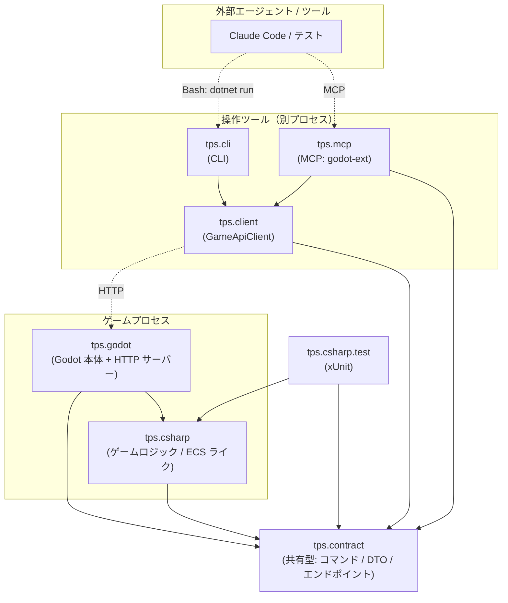

# tps

Godot 4.6 (C#) で作る TPS (Third-Person Shooter) ゲーム。

詳細な設計・開発ルールは [CLAUDE.md](CLAUDE.md)、設計判断の記録は [docs/adr](docs/adr) を参照。

## プロジェクト構成

| プロジェクト | 役割 |
|---|---|
| `tps.godot` | Godot プロジェクト本体。Node・シーン・物理など Godot 依存コード。HTTP サーバーを内蔵 |
| `tps.csharp` | 純粋 C# クラスライブラリ。Godot 非依存のゲームロジック（ECS ライク） |
| `tps.csharp.test` | `tps.csharp` の単体テスト（xUnit + Shouldly） |
| `tps.contract` | コマンド定義・DTO・エンドポイントなど共有型 |
| `tps.client` | ゲーム HTTP 通信層。MCP・CLI 共通の `GameApiClient` |
| `tps.mcp` | MCP サーバー（godot-ext）。実行中ゲームへのコマンド投入・状態取得 |
| `tps.cli` | CLI ツール。ゲーム固有操作をコマンドラインから実行 |

## アーキテクチャ

実線（`──▶`）はビルド時のプロジェクト参照、破線（`-.->`）は実行時の HTTP 通信を表す。



### レイヤーの考え方

```
外部エージェント / テスト
        ↓ MCP / CLI コマンド
   tps.mcp・tps.cli  ─→ tps.client (GameApiClient)
        ↓ HTTP
   tps.godot (薄いシェル)  ← Godot 依存処理のみ
        ↓ interface
   tps.csharp (ロジック)   ← Godot 非依存、テスト可能
```

- `tps.csharp` は Godot に依存しない。境界は interface 経由のみで、xUnit でテスト可能
- MCP・CLI はどちらも `tps.client` の `GameApiClient` 経由で同じ HTTP 口を叩く
- 共有型（コマンド・DTO・エンドポイント）は `tps.contract` に集約する
