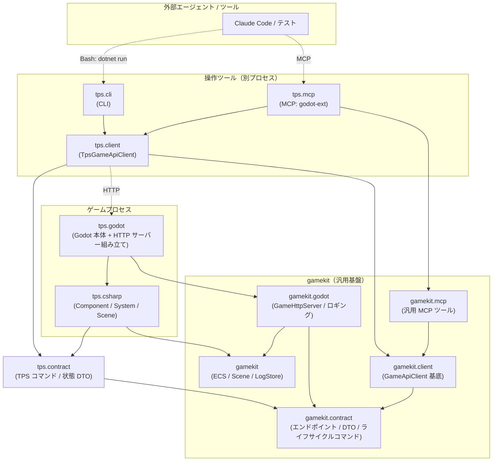

# tps

Godot 4.6 (C#) で作る TPS (Third-Person Shooter) ゲーム。

汎用ゲーム基盤 **gamekit** と、その上に乗る **tps** ゲーム実装の 2 層で構成する。
詳細な設計・開発ルールは [CLAUDE.md](CLAUDE.md)、設計判断の記録は [docs/adr](docs/adr)（基盤切り出しは [ADR-0012](docs/adr/0012-gamekit-foundation-extraction.md)）を参照。

## プロジェクト構成

### gamekit（汎用基盤・ゲームジャンル非依存）

| プロジェクト | 役割 |
|---|---|
| `gamekit` | ECS コア（World / Entity / EntityId）・シーン抽象（IScene / ISceneQuery）・構造化ログストア |
| `gamekit.contract` | 汎用エンドポイント・DTO・ライフサイクルコマンド（Pause / Resume / Quit） |
| `gamekit.client` | ゲーム HTTP 通信の基底 `GameApiClient`。state はジェネリック / raw JSON の 2 口 |
| `gamekit.godot` | Godot アダプタ。`GameHttpServer`（HTTP サーバー部品）・組み込みルート・ロギングプロバイダ |
| `gamekit.mcp` | 汎用 MCP ツール（ping・入力シミュレーション・状態取得・スクリーンショット） |
| `gamekit.test` | 基盤の単体テスト（xUnit + Shouldly） |

### tps（このゲーム）

| プロジェクト | 役割 |
|---|---|
| `tps.godot` | Godot プロジェクト本体。Node・シーン・物理など Godot 依存コード。HTTP サーバーの組み立てと TPS ルート登録 |
| `tps.csharp` | TPS のゲームロジック。Component / System / Scene（Godot 非依存） |
| `tps.csharp.test` | `tps.csharp` の単体テスト（xUnit + Shouldly） |
| `tps.contract` | TPS コマンド・状態 DTO・TPS エンドポイント（camera_pitch / look_at / set_aiming） |
| `tps.client` | `TpsGameApiClient`（`GameApiClient` を TPS 固有 API で拡張） |
| `tps.mcp` | MCP サーバー（godot-ext）。gamekit.mcp の汎用ツール + TPS 固有ツールを合成 |
| `tps.cli` | CLI ツール。汎用コマンド（GameCommands）+ TPS 固有コマンド（TpsCommands） |

## アーキテクチャ

実線（`──▶`）はビルド時のプロジェクト参照（主要なもののみ。明示参照の全量は各 csproj を参照）、破線（`-.->`）は実行時の HTTP 通信を表す。



### レイヤーの考え方

```
外部エージェント / テスト
        ↓ MCP / CLI コマンド
   tps.mcp・tps.cli  ─→ tps.client / gamekit.client
        ↓ HTTP
   tps.godot (薄いシェル)  ← Godot 依存処理のみ。gamekit.godot の部品で HTTP サーバーを組む
        ↓ interface
   tps.csharp (ロジック)   ← Godot 非依存、テスト可能
        ↓
   gamekit (基盤)          ← ECS / シーン抽象 / ログストア。ゲームジャンル非依存
```

- 参照は常に `tps.*` → `gamekit.*` の一方向。基盤はゲームを知らない
- 基盤は具象 Component を持たない。`IComponent` だけが基盤で、データはすべてゲーム定義
- MCP・CLI はどちらも `GameApiClient`（基底）/ `TpsGameApiClient`（TPS 拡張）経由で同じ HTTP 口を叩く
- 共有型は汎用なら `gamekit.contract`、TPS 固有なら `tps.contract` に置く
