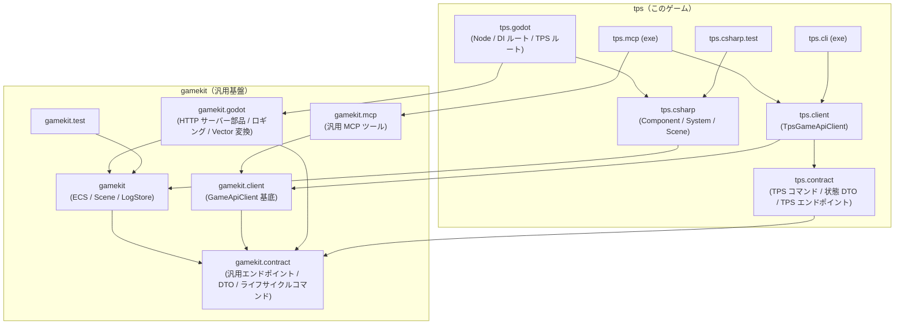

# 計画: 汎用ゲーム基盤「gamekit」の切り出し

## 目的

現在 `tps.*` に混在している「どのゲームでも使える概念」と「TPS 固有のゲーム実装」を分離し、

> **汎用基盤 (gamekit) があり、その上に TPS ゲームが乗っている**

という立て付けに変える。オセロ・横スクロール・格ゲー・ノベルゲーを実際に実装する必要はないが、それらを作るとしても基盤側を変更せずに済む程度の汎用性を目指す。

基盤の名称は仮に **`gamekit`** とする（`core` / `foundation` 等への変更はこの段階なら容易）。同一リポジトリ内のプロジェクト分割とし、NuGet 化・別リポジトリ化は将来の選択肢として残す。

## 現状分析: 何が汎用で、何が TPS 固有か

### すでに汎用なもの（TPS への依存ゼロ。移動するだけでよい）

| 現在地 | ファイル | 内容 |
|---|---|---|
| `tps.csharp` | `World.cs` `Entity.cs` `EntityId.cs` `IComponent.cs` `IIdGenerator.cs` | ECS ライク基盤（EntityId → Component のデータ置き場） |
| `tps.csharp` | `IScene.cs` `ISceneQuery.cs` | シーン抽象・コマンド公開・状態スナップショット（CQRS の読み取り口） |
| `tps.csharp` | `Logging/ILogStore.cs` `GameLogEntry.cs` `InMemoryLogStore.cs` | 構造化ログストア |
| `tps.contract` | `GamePauseRequested` `GameResumeRequested` `QuitRequested` | System レベルのライフサイクルコマンド |
| `tps.contract` | `InputEndpoints`（一部）, `PingResponse` `GetActionsResponse` `PressActionRequest/Response` `CommandListResponse` | リモート操作 API の汎用エンドポイントと DTO |
| `tps.client` | `GameApiClient`（一部） | ping / actions / press_action / screenshot / state / commands |
| `tps.godot` | `InputServer.cs` の HTTP プラミング | TCP/HTTP のパース・レスポンス書き込み・ルーティング |
| `tps.godot` | `Logging/*`（AppLogger, GodotLoggerProvider, JsonlLoggerProvider）`VectorExtensions.cs` | Godot 向けロギング基盤・Vector 変換 |
| `tps.mcp` | `InputSimulationTools` `GameStateTools` | 入力シミュレーション・状態取得（中身は汎用 API の中継） |

### TPS 固有なもの（ゲーム層に残す）

| 現在地 | 内容 |
|---|---|
| `tps.csharp` | 全 Component（Health / Weapon / Ads / Camera / Movement / Transform / Bounds）、全 System（Health / Weapon / Movement / Kill）、`GameEvents`、`InGameScene`、`PlayerSettings` `PlayerMovement` `CameraAim` と旧実装（`Health` `KillCounter` `PlayerController` `WeaponState`） |
| `tps.contract` | TPS ゲームコマンド（ShotFired / TargetHit / PlayerMove 等）、`GameStateResponse` + DTO 群（Weapon / Bounds 等）、カメラ操作系（CameraPitch / LookAt / SetAiming） |
| `tps.godot` | `Main` `Player` `Target` `Bullet` `Hud` `PauseDialog`、InputServer の TPS ルート（/state の DTO 構築・/camera_pitch・/look_at・/set_aiming） |
| `tps.mcp` | `CameraControlTools` |

## 設計判断（方針）

1. **基盤に具象 Component を置かない。** `IComponent` だけが基盤で、`TransformComponent` 含む全 Component はゲーム定義とする。Transform/Bounds は 3D ゲーム共通に見えるが、ノベルゲー等には不要であり、「2 つ目のゲームが必要としたら昇格」ルールで運用する。これが最もきれいな切断面。
2. **VitalRouter を基盤の公式コマンドバスとする。** コマンドは `VitalRouter.ICommand` 実装という規約を基盤側が持つ（過剰な `ICommandPublisher` 抽象は作らない）。`gamekit.contract` は VitalRouter に依存してよい。
3. **/state のペイロードはゲーム定義。** 基盤はエンドポイントパスと「ゲームが組み立てた DTO を返す」枠だけ提供する。クライアント側は `GetStateAsync<TState>()` のジェネリックメソッド、サーバー側はゲームが注入する state ビルダー（`Func<ISceneQuery, object>` 相当）で拡張する。
4. **Godot の Node クラスは tps.godot に残す。** Godot はシーンにアタッチするスクリプトをゲーム本体アセンブリに要求するため、`InputServer`（autoload Node）自体は tps.godot に残し、HTTP パース・ルーティング・組み込みルートは gamekit.godot のプレーンクラスに委譲する（継承でなくコンポジション）。
5. **CLI は分割しない。** ConsoleAppFramework v5 はソースジェネレータ前提でコマンドクラスの別アセンブリ化と相性が悪いため、`tps.cli` 1 プロジェクトのまま、コマンドクラスを「汎用」「TPS 固有」の 2 クラスに分けるに留める。
6. **MCP は library + exe に分割。** `ModelContextProtocol` の `WithTools<T>` は参照アセンブリの型で問題なく動くため、汎用ツールは `gamekit.mcp`（ライブラリ）へ、`tps.mcp` は exe としてツールを合成する。

## 提案する構成

### 各プロジェクトの中身

| プロジェクト | TFM | 主な内容 | 主な依存 |
|---|---|---|---|
| `gamekit` | net8.0 | `World` `Entity` `EntityId` `IComponent` `IIdGenerator` `SequentialIdGenerator` `IScene` `ICommandDescriptor` `ISceneQuery` `IObjectSnapshot` `ILogStore` `GameLogEntry` `InMemoryLogStore` | UnitGenerator, MS.Ext.Logging.Abstractions |
| `gamekit.contract` | net8.0 | `InputEndpoints`（Port / BaseUrl / Ping / Actions / PressAction / Screenshot / State / Commands）、汎用 DTO（Ping / Actions / PressAction / CommandList）、ライフサイクルコマンド（Pause / Resume / Quit） | VitalRouter |
| `gamekit.client` | net8.0 | `GameApiClient`（Ping / GetActions / PressAction / Screenshot / GetAvailableCommands / `GetStateAsync<TState>` / `GetStateRawAsync`） | gamekit.contract |
| `gamekit.godot` | net8.0 (Godot.NET.Sdk/4.6.2) | HTTP リクエストパーサ・レスポンスライタ・ルートテーブル、組み込みルート（ping / actions / press_action / screenshot / commands / state 枠）、`AppLogger` `GodotLoggerProvider` `JsonlLoggerProvider` `VectorExtensions` | gamekit, gamekit.contract |
| `gamekit.mcp` | net10.0 (lib) | `InputSimulationTools`（ping / get_actions / press_action / take_screenshot）、`GameStateTools`（get_game_state: raw JSON を ToonEncoder 中継 / get_available_commands） | gamekit.client, ModelContextProtocol, ToonEncoder |
| `gamekit.test` | net10.0 | `World` `Entity` `SequentialIdGenerator` `InMemoryLogStore` のテスト（LogStoreTest を移設 + World/Entity テストを新規追加） | gamekit, xUnit, Shouldly |
| `tps.csharp` | net8.0 | Component / System / `GameEvents` / `InGameScene` / `PlayerSettings` ほか TPS ロジック一式 | gamekit, tps.contract |
| `tps.contract` | net8.0 | TPS ゲームコマンド、`GameStateResponse` + DTO、`TpsEndpoints`（CameraPitch / LookAt / SetAiming）と関連 Request/Response | gamekit.contract |
| `tps.client` | net8.0 | `TpsGameApiClient : GameApiClient`（SetAiming / SetCameraPitch / LookAt / TPS 型の GetState） | gamekit.client, tps.contract |
| `tps.godot` | net8.0 | 既存 Node 群 + `InputServer`（gamekit.godot の部品を合成し TPS ルートと state ビルダーを登録） | gamekit.godot, tps.csharp, tps.contract |
| `tps.mcp` | net10.0 (exe) | `Program`（汎用ツール + `CameraControlTools` を合成） | gamekit.mcp, tps.client |
| `tps.cli` | net10.0 (exe) | `GameCommands`（汎用: ping / state / commands / actions / press / screenshot）+ `TpsCommands`（aim / pitch / look-at） | tps.client |

名前空間はプロジェクト名に合わせ小文字（`gamekit` `gamekit.contract` …）とし、既存の `tps.*` スタイルに揃える。

## 移行ステップ

各フェーズの完了条件は「`dotnet build` 全プロジェクト成功 + `dotnet test`（gamekit.test / tps.csharp.test）グリーン」。フェーズごとにコミットする。

### Phase 1: `gamekit`（コア）+ `gamekit.test`

1. `gamekit/` プロジェクト新規作成（net8.0、UnitGenerator / MS.Ext.Logging.Abstractions）。
2. `tps.csharp` から上記コアファイル群を移動し、名前空間を `gamekit` に変更。`EntityId` の UnitGenerator 属性はそのまま（基底型 string、wire format 不変）。
3. `tps.csharp` に `gamekit` への ProjectReference を追加し、全 using を更新（tps.godot / tps.csharp.test も）。
4. `gamekit.test/` 新規作成。`LogStoreTest` を移設し、現在テストが存在しない `World` / `Entity` / `SequentialIdGenerator` のテストを新規追加（テスト規約どおり `
` に検証内容と期待値を日本語で記述）。

### Phase 2: `gamekit.contract`

1. `gamekit.contract/` 新規作成（VitalRouter 参照）。
2. `tps.contract` から移動: `InputEndpoints` の汎用部分、`PingResponse` `GetActionsResponse` `PressActionRequest/Response` `CommandListResponse`、ライフサイクルコマンド 3 種（`GamePauseRequested` / `GameResumeRequested` / `QuitRequested`）。
3. `tps.contract` に残す/新設: TPS コマンド群、`GameStateResponse` + DTO、`TpsEndpoints`（CameraPitch / LookAt / SetAiming のパス定数）+ カメラ系 Request/Response。`tps.contract` → `gamekit.contract` 参照を追加。

### Phase 3: `gamekit.client`

1. `gamekit.client/` 新規作成。`GameApiClient` を移し、汎用メソッドのみ残す。`/state` は `GetStateAsync<TState>()`（および MCP 中継用に raw 文字列取得）に一般化。
2. `tps.client` は `TpsGameApiClient : GameApiClient` に変更し、SetAiming / SetCameraPitch / LookAt と TPS 型 GetState を実装。
3. `tps.mcp` / `tps.cli` の参照型を `TpsGameApiClient` に差し替え。

### Phase 4: `gamekit.godot`

1. `gamekit.godot/` 新規作成（`Godot.NET.Sdk/4.6.2` のライブラリプロジェクト）。
2. `InputServer.cs` から HTTP プラミング（リクエスト読み取り・レスポンス書き込み）とルートテーブルを抽出してプレーンクラス化。組み込みルート（ping / actions / press_action / screenshot / commands / state 枠）を基盤側で提供。state はゲーム注入のビルダーに委譲。
3. `Logging/*` と `VectorExtensions` を移動。
4. `tps.godot/InputServer.cs` は薄い Node に書き直し: 基盤部品を組み立て、TPS ルート（camera_pitch / look_at / set_aiming）と TPS state ビルダー（World → `GameStateResponse`）を登録する。autoload 設定はそのまま。

### Phase 5: `gamekit.mcp` + CLI 内部整理

1. `gamekit.mcp/`（ライブラリ）新規作成。`InputSimulationTools` `GameStateTools` を移動し、`GameStateTools` は raw JSON 中継 + ToonEncoder に一般化。
2. `tps.mcp` は exe として `WithTools<汎用>` + `WithTools<CameraControlTools>` を合成。
3. `tps.cli` 内で `TpsCommands` を `GameCommands`（汎用）と `TpsCommands`（TPS 固有）に分割（プロジェクト分割はしない）。

### Phase 6: ドキュメント更新

1. `README.md`: アーキテクチャ図を「gamekit 基盤 + tps ゲーム」の 2 層構成に更新。
2. `CLAUDE.md`: プロジェクト構成表・レイヤー図・責務記述を更新（「gamekit の責務 / tps の責務」を明記）。
3. `docs/adr/0012-gamekit-foundation-extraction.md` を新規作成: 切り出しの動機、「具象 Component は基盤に置かない」「VitalRouter を公式コマンドバスとする」「Node はゲーム側・ロジックは基盤側（コンポジション）」等の判断を記録。

## リスクと対策

| リスク | 対策 |
|---|---|
| `Godot.NET.Sdk` のライブラリプロジェクト（gamekit.godot）がビルド/エディタ連携で問題を起こす | 代替 1: `GodotSharp` NuGet 直接参照。代替 2: 当面 tps.godot 内の `GameKit/` フォルダ（名前空間のみ分離）に置き、プロジェクト分離を後回しにする |
| Godot がシーンアタッチ用スクリプトをゲームアセンブリに要求する | Node クラス（InputServer 等）は tps.godot に残し、基盤はプレーンクラス提供に徹する（方針 4 で織り込み済み） |
| ConsoleAppFramework のソースジェネレータが別アセンブリのコマンドクラスを扱えない | CLI はプロジェクト分割しない（方針 5 で織り込み済み） |
| 名前空間一斉変更によるビルド断 | フェーズごとに完結させ、各フェーズ末で build + test を通してからコミット |
| `EntityId` 移動によるシリアライズ互換 | 基底型 string の JsonConverter で wire format は名前空間に依存しないため影響なし（確認はテストで担保） |

## スコープ外（やらないこと）

- オセロ・横スクロール等、2 つ目のゲームの実装
- gamekit の NuGet パッケージ化・別リポジトリ化
- 旧実装（`Health` / `KillCounter` / `WeaponState` と R3 依存）の整理・削除（別タスク。`PlayerController` は `Player.cs` から使用中のため現状維持）
- HTTP ポート (9876) の設定可能化などの機能追加
